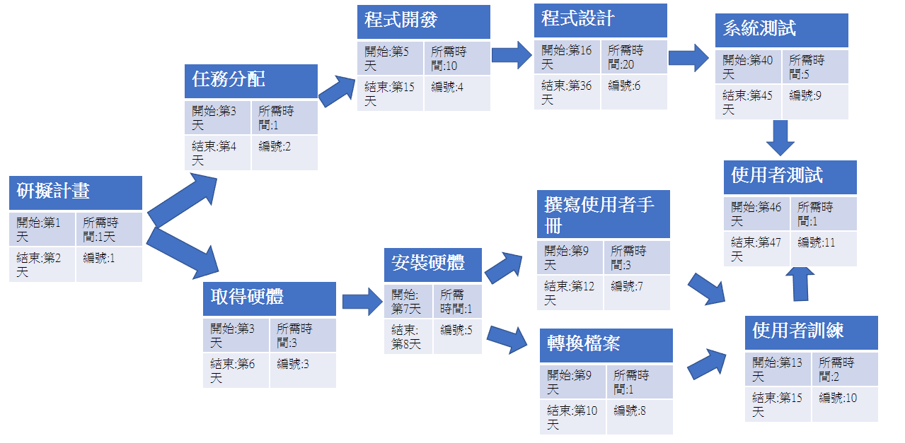
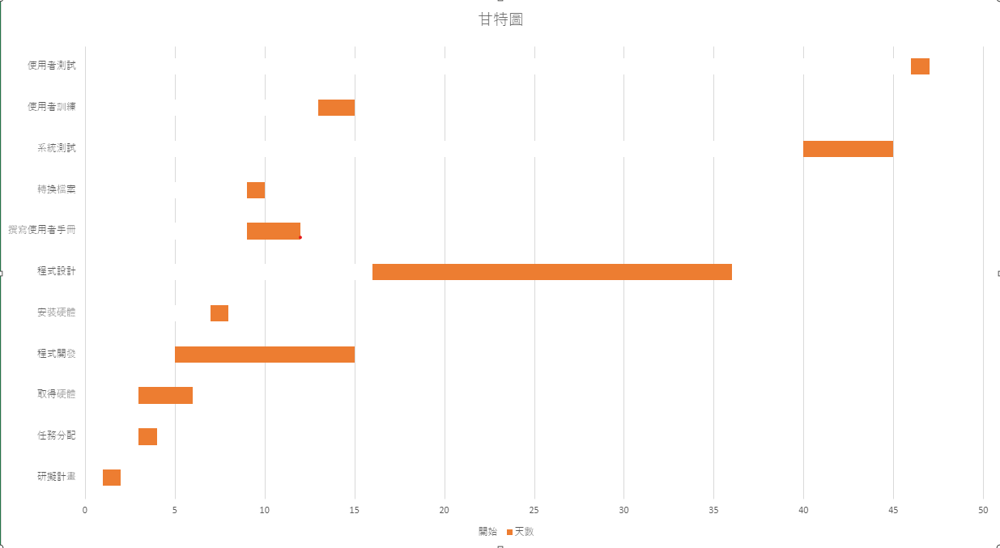

# Group11
# 主題:虛擬視訊
---
|學號| 成員   |
|--------|--------|
|C108118205| 彭俊翔 |
|C108193235| 李承霈 |
|C108118227|林己珷|
|| 江宥宸 |
---
# 內容
## 讓不想在視訊中露臉的人，能有其他選擇。
---
# PERT/CPM圖

## 關鍵路徑
### 1-2-4-6-9-11
---
# 甘特圖

---
# 功能性需求
### 1.臉部偵測
### 2.身體偵測
### 3.模型切換
---
# 非功能性需求
### 1.偵測準確度
### 2.偵數
### 3.渲染度
---
